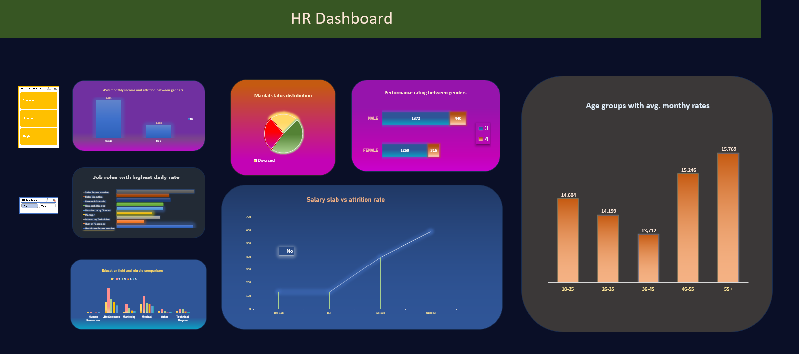

# HR Analytics Excel Dashboard

## Project Overview

This project aims to create an interactive and informative HR analytics dashboard using Microsoft Excel. The dashboard is designed to be a powerful tool for data analysis and decision-making for HR professionals and organizational leaders. It includes various pivot tables and charts that provide insights into key HR metrics.

## Key Features

### Average Monthly Income by Gender
- Pivot table showcasing the average monthly income, categorized by gender (Male and Female).
- Visual representation of income data for easy comparison between male and female employees.

### Average Daily Rate by Job Role
- Pivot table presenting the average daily rate for different job roles.
- Visual chart to identify patterns in daily rates across job roles.

### Attrition Analysis by Salary Slab
- Pivot table displaying attrition counts by different salary slabs.
- A chart representation to understand attrition trends based on income levels.

### Job Level Distribution by Department
- Pivot table illustrating the distribution of job levels within various departments.
- Visual chart showing the count of employees in different job levels across departments for workforce analysis.

### Performance Rating Analysis by Gender
- Pivot table providing insights into performance ratings, categorized by gender.
- A chart to visualize the distribution of performance ratings among male and female employees.

### Marital Status of Employees
- Pivot table displaying the count of employees by marital status.
- A chart illustrating the marital status distribution within the organization.

### Average Monthly Rate by Age Group
- Pivot table indicating the average monthly rate for different age groups.
- A chart representing the monthly rate by age group to understand how compensation varies with age.

## Usage

To use the HR Analytics Excel Dashboard:
1. Open the Excel file containing the dashboard.
2. Interact with pivot tables and charts to explore HR data.
3. Filter and drill down into specific aspects of HR analytics.
4. Gain insights for data-driven decision-making in HR and talent management.

## Conclusion

The HR Analytics Excel Dashboard empowers HR professionals and organizational leaders with a user-friendly tool to analyze and visualize HR data effectively. It aids in understanding HR trends, making data-driven decisions, and contributing to better talent management, employee satisfaction, and overall organizational success.
